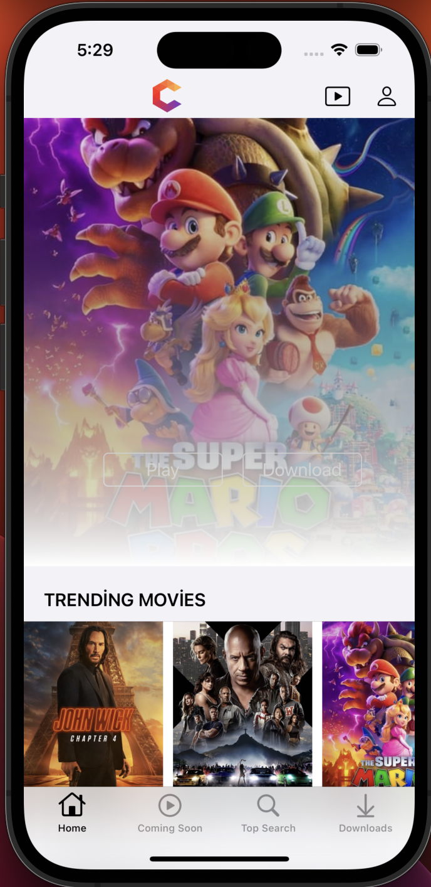
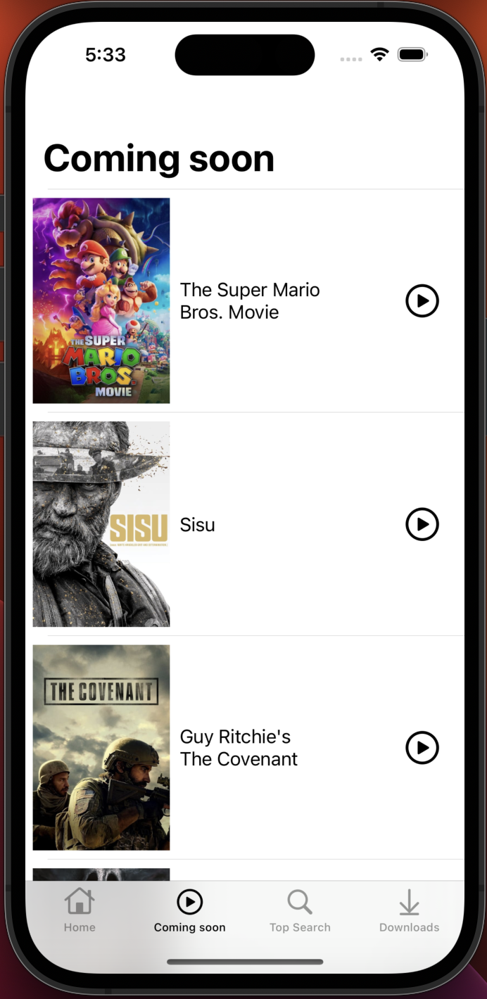
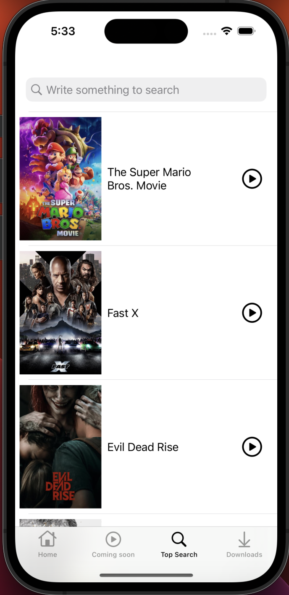
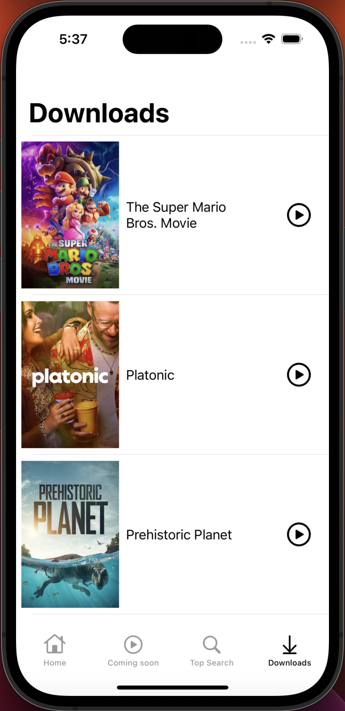
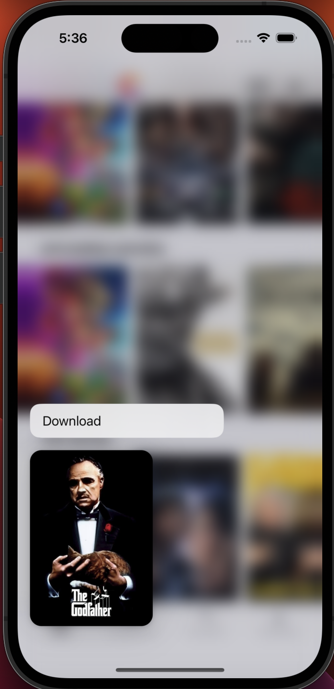
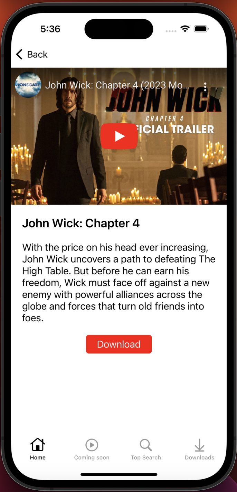
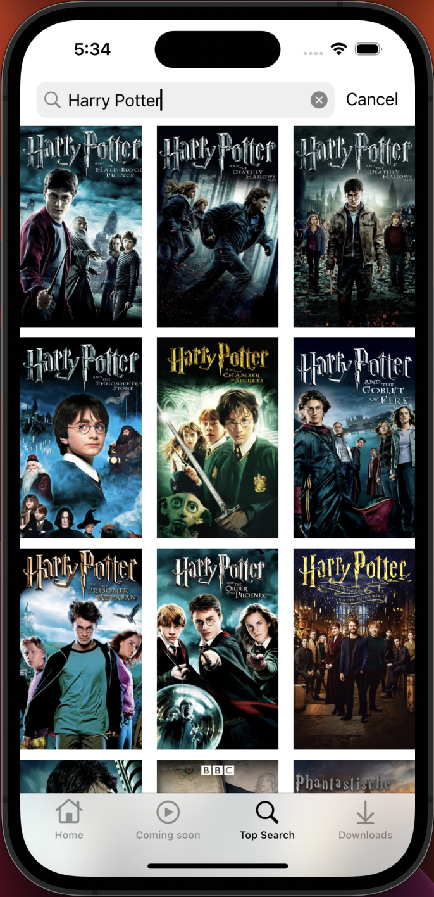

# Programmatic - MVVM (Model View ViewModel) -  API Calls

Home     |  Coming Soon | Top Search
:-------------------------:|:-------------------------:|:-------------------------:
||

Downloads     |  Download Movie|  Movie Preview
:-------------------------:|:-------------------------:|:-------------------------:
||

Search Movie
:-------------------------:|:-------------------------:|:-------------------------:

## Characteristics

- [x] UIKit
- [x] MVVM architecture
- [x] Singleton Design Pattern
- [x] URLSession - Generic Api calls - Networking API
- [x] Decodable Protocol with JSONDecoder
- [x] Downloading Image - SDWebImage Library
- [x] Swift Package Manager - SPM
- [x] Closure, Completion, Enum
- [x] Memory Management

## Social Media
- Linkedin: https://www.linkedin.com/in/umitsimsekk
- Instagram: https://www.instagram.com/umitsimsekk
